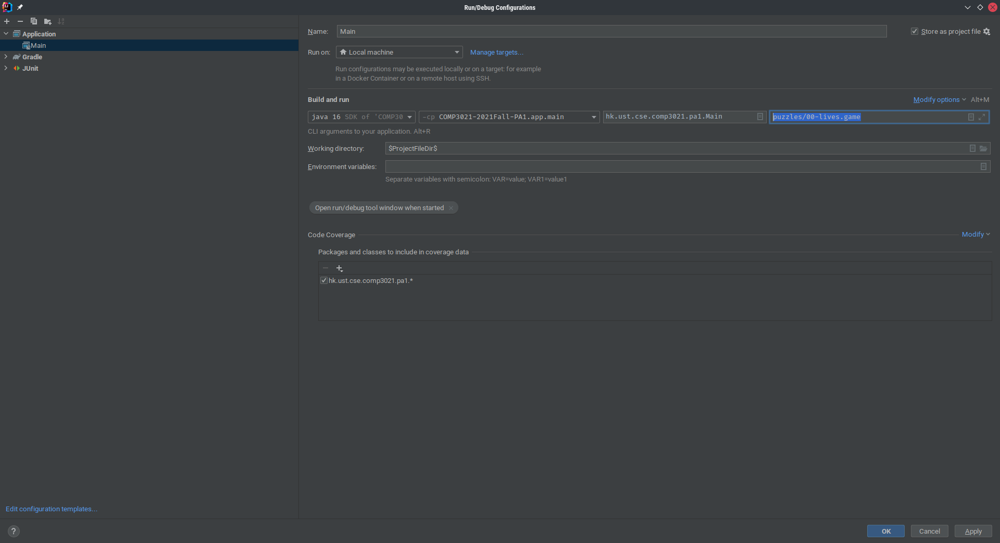
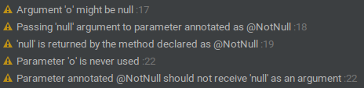

# COMP3021 PA1: Inertia ASCII Game

Inertia is a puzzle game, originally implemented by Ben Olmstead. The objective of this game is to collect all gems 
without running into mines, with the added twist that you will not stop once you start moving until you hit either a 
wall, a "stop cell", a mine, or the border of the game board.

An online demo of the game can be found [here](https://www.chiark.greenend.org.uk/~sgtatham/puzzles/js/inertia.html).

*This is a long file. Please take your time to read this document, and refer to this document often if you have any 
questions before asking your TAs.*

## Quick Links

- [Game Elements](#game-elements)
- [Game Representations](#game-representations)
- [Game Mechanics](#game-mechanics)
- [Loading a Game](#loading-a-game)
- [Java Concepts](#java-concepts)
- [Tasks](#tasks)
- [IntelliJ Run Configurations](#intellij-run-configurations)

## Game Elements

There are two types of game elements: Cells and entities.

### Cells

Cells are the components that make up a game board. Each cell represents a single tile on the game board.

Cells are categorized into the following types:

- `Wall`: A cell that the player cannot directly move/slide past.
- `EntityCell`: A cell that can house an entity.
- `StopCell`: An `EntityCell` that causes the player to stop "sliding".

### Entities

Entities are objects that can reside on an entity cell.

Entities are categorized into the following types:

- `ExtraLife`: Picking up of this entity will increase the number of lives of the player.
- `Gem`: Picking up of this entity will enable the player to collect a gem.
- `Mine`: Crossing over of this entity will cause the player to lose a life.
- `Player`: That's you (or a computer in future assignments)!

## Game Representations

There are two modes in which you can run this game.

### ASCII Version

By default, the game runs in ASCII mode. A simple game board will look as follows:

```
$ java --enable-preview -jar PA1-obf.jar puzzles/00-unicode-test.game
@#*
LWX
...
```

Where each character represents the following type of tile:

- `@`: The player
- `#`: A "stop cell"
- `*`: A gem
- `L`: A cell with an extra life
- `W`: A wall
- `X`: A cell with a mine
- `.`: An empty cell

### Unicode Version

If your console supports Unicode characters, you may also opt to play the game in Unicode mode, by passing `--unicode`
to the arguments of the JAR.

```
$ java --enable-preview -jar PA1-obf.jar --unicode puzzles/00-unicode-test.game
◯□◇
♡█⚠
...
```

Where each character represents the following type of tile:

- `◯`: The player
- `□`: A "stop cell"
- `◇`: A gem
- `♡`: A cell with an extra life
- `█`: A wall
- `⚠`: A cell with a mine
- `.`: An empty cell

You might want to zoom into your console using this mode, since the characters might be difficult to differentiate using
the default font size.

## Game Mechanics

### Basic Controls

- `up`/`down`/`left`/`right`: Moves the player in the specified direction
- `quit`: Quits the game
- `undo`: Undoes a move

### Map Specifications

When loading a map, you must ensure the following requirements are met:

- The size of the game board must be the same value as those passed in by the parameters `numRows` and `numCols`.
- There must only be a single player on the game board.
- There must be at least one gem on the game board.
- All gems must be reachable by the player (i.e., there must be a path not blocked by walls between the player and each gem).

These requirements are also stated in the constructor of `GameBoard`. You should throw an `IllegalArgumentException` if
any of these requirements are not met. See the [Exceptions](#exceptions) section on how to throw an exception.

### Game Rules

See the [Game Representations](#game-representations) section for how to interpret the game board. Note that this
section may not cover all cases; You are encouraged to check the obfuscated JAR for any behavior unspecified in this
document.

- When the player moves in a direction, they will "slide over" each cell of the given direction until the next adjacent
  cell is a wall or would be outside the game boundaries.

  Consider the following example:

  ```
  @........  ->  #.......@
  ```

  When the player moves to the right, the player will step on each cell, until the player reaches the end of the row and
  stops.

  ```
  @...W...  ->  #..@W...
  ```

  Similarly, when the player moves to the right, the player will step on each cell. However, once the player reaches
  (0,3), since the adjacent cell is a wall, the player cannot move past it, and so it will stop there.

- A player can also stop if it passes through a "stop cell".

  ```
  @...#...M  ->  #...@...M
  ```

  When the player moves to the right, the player will move across each cell until it reaches the "stop cell" at (0,4).

- A player will pick up all entities of cells they passed through. An exception to this rule is when the player dies
  while making this move.

  ```
  @********#  ->  #........@
  ```

  When the player moves to the right, the player collects the gems of each cell they pass through.

- If a player moves in a direction that cannot be moved in (for instance because there is a wall or it would go outside
  of the game board boundaries), the move is considered to be an invalid move.

  ```
           Move=RIGHT
  @W*      --------->  @W*
  ...                  ...
  Moves=0              Moves=0
  ```

  In the example, when the player tries to move to the right, they are blocked by the wall. Therefore, this is
  considered as an invalid move, and you should not increment the number of moves in this case.

  Note that this only applies when the player tries to move in the direction whose adjacent cell is invalid. In other
  words, this rule only applies if the player does not move anywhere:

  ```
           Move=RIGHT
  @.W*     --------->  #@W*
  ....                 ....
  Moves=0              Moves=1
  ```

- If a player passes through a mine while moving in a direction, they instantly die. All entities collected during the
  move is invalidated, meaning that it is treated as if the player did not pick them up.

  ```
  @.*.M    ->  ....X  -> @.*.M
  Lives=3                Lives=2
  Deaths=0               Deaths=1
  Moves=0                Moves=1
  ```

  When the player moves to the right, the player will pick up the gem in (0,2), and proceed to be blown up by the mine
  in (0,4). Therefore, the move is rolled back, and the number of deaths of the player is incremented by one. The number
  of moves is also incremented by one, since this move is considered as a valid move (despite resulting in the player's
  death).

  If the player has surplus lives, the number of lives is decremented by one.

### Undo

The undo functionality undoes a single step made by the player. You should ensure that all game state is restored by the
undo logic, including:

- The position of the player
- The number of lives of the player (if extra life(s) were picked up)
- The entities which existed before the move was made, if any

You should **NOT** modify the following during the undo:

- The number of moves made by the player
  - The undo itself does **NOT** count as a move
- The number of deaths of the player

For example:

```
          Move             Undo
@L*.#.M   --->  #...@.M    --->  @L*.#.M  
Lives=2         Lives=3          Lives=2
Moves=0         Moves=1          Moves=1
```

### Winning and Losing Conditions

The game is won when all gems are collected from the game board.

The game is lost when the player runs out of lives. This means that if the player has an unlimited number of lives, the
game will never be lost ~~(unless the player quits in frustration)~~.

### Hints for "All Gems Reachable" Implementation

Not sure how to implement this algorithm?

In order to determine whether all gems are reachable by the player, you first need to determine all cells which are
reachable from the player. Once you have that information, you can then check whether all gems reside in a cell which
is reachable from the player.

```
All-gems-reachable(board, player):
    NumTotalGems := Count-gems(board)
    ReachableCells := All-reachable-cells(player)

    NumReachableGems := 0
    foreach cell in ReachableCells:
        if cell contains Gem:
            NumReachableGems := NumReachableGems + 1

    return NumTotalGems == NumReachableGems
```

How do you determine which cells are reachable from the player then? The
[flood fill algorithm](https://en.wikipedia.org/wiki/Flood_fill), which is a family of algorithms for filling in closed
regions, may be helpful. You may refer to the algorithms' pseudocode implementations to understand how this algorithm
can be implemented.

Note that you do not need to consider mines as a potential obstacle; Only walls need to be considered. However, you are
free to add to this algorithm to provide more robust checking of whether a gem is reachable.

## Loading a Game

The game *must* be launched with an argument specifying the game file to load.

Several puzzles are provided for you under the directory `puzzles`.

### Obfuscated JAR

An obfuscated JAR is provided for reference, located in the [artifacts](artifacts) directory.

To launch the game using the obfuscated JAR, use the following command-line:

```
$ java --enable-preview -jar PA1-obf.jar [--unicode] PUZZLE_PATH
```

For instance, to load the game `puzzles/00-unicode-test.game`:

```
$ java --enable-preview -jar PA1-obf.jar [--unicode] puzzles/00-unicode-test.game
```

### IntelliJ IDEA

When testing your own implementation, you may use the provided `Main` Run Configuration.

To edit the command-line arguments, go to `Run > Edit configurations`, and edit the highlighted text box:



### Designing Custom Games

*Done with the assignment or just wanting to slack off? Why not design your own games to play with?*

The format of each game file is as follows:

```
<number of rows>
<number of columns>
<number of lives; may be blank for unlimited>
<row 1 cells>...
<row 2 cells>...
...
```

Note that the representation of these cells are (yet again) different from the ones used for display:

- `W`: Wall
- `L`: Extra Life on an `EntityCell`
- `G`: Gem on an `EntityCell`
- `M`: Mine on an `EntityCell`
- `P`: Player on a `StopCell`
- `S`: A blank `StopCell`
- `.`: A blank `EntityCell`

Note that loading a game has been implemented in `GameStateSerializer`, so you do not need to do anything there.

See the `puzzles` directory for examples.

## Java Concepts

You are expected to be familiar with the lecture content up to Week 3; Other concepts which are not taught up to that 
point are explained in this section.

You may also want to look at the ["optional" section](#want-to-know-more) to read about the Java concepts used to 
implement the provided code.

### Exceptions

[Lecture Slides](https://course.cse.ust.hk/comp3021/notes/5-Exception.pdf)

Exceptions are a kind of error-reporting mechanism used in exceptional circumstances (*see what I did there?*). They are
generally used to indicate unexpected conditions or program state while the program is running.

In general, the syntax for throwing an exception is

```
throw new <className>(<params>...);
```

where `<className>` is the exception class (which extends `Exception` or `Throwable`) you want to throw.

There are several methods scattered around the skeleton code that *requires* you to throw an exception when certain 
conditions are (not) satisfied. When using these methods, remember to observe the requirements as documented by the 
method's Javadoc (especially the `@throws` section). For example, for `Position.offsetBy`:

```java
    /**
     * ...
     * @throws IllegalArgumentException if any component of the resulting coordinate is negative.
     */
    @NotNull
    public Position offsetBy(@NotNull final PositionOffset offset) {
        // ...
    }
```

This indicates that you should probably check the requirement of the method is met before calling this method, or use
some other alternative that does not have this requirement.

You may also catch an exception to "recover" from an error. The general syntax for that is

```
try {
    // do something that might throw an exception
} catch (<className> <variableName>) {
    // recovery logic
}
```

Note that this assignment does not and should not require the use of try-catch blocks; In fact, the reference solution 
does not make use of try-catch blocks (except for the provided code). Use them at your own risk!

### Sealed Classes

[Lecture Slides](https://course.cse.ust.hk/comp3021/notes/11a-Upcoming%20Features.pdf)

Sealed classes are a special kind of class which only allows a specific classes to inherit from it. The purpose of 
sealed classes is to limit a class to only contain a known subset of subclasses.

Consider an example:

```java
abstract class Binary {

    public String toString() {
        if (this instanceof Zero) {
            return "0";
        } else if (this instanceof One) {
            return "1";
        } else {
            // What are we supposed to do here???
            throw new RuntimeException();
        }
    }
}
class Zero extends Binary {}
class One extends Binary {}
```

For `Binary.toString()`, the last `else` branch is necessary because there may theoretically be a third class that 
extends `Binary`, despite that we know `Zero` and `One` are the only possible subclasses.

Sealed classes solve this problem by requiring all subclasses of a sealed class to either be a *nested static class* or
included in the class declaration, for example:

```java
sealed abstract class Binary {

    final static class Zero extends Binary {}
    final static class One extends Binary {}

    public String toString() {
        // ...
    }
}
// or
sealed abstract class Binary permits Zero, One {

  public String toString() {
    // ...
  }
}

final class Zero extends Binary {}
final class One extends Binary {}
```

The implementation for `Binary.toString()` still needs to be the same, because Java currently does not have a mechanism
to deduce this information. However, in Java 17 (Preview), 
[*Pattern Matching for Switch*](https://openjdk.java.net/jeps/406) will allow for this:

```java
sealed abstract class Binary {

    public String toString() {
        return switch (this) {
            case Zero zero -> "0";
            case One one -> "1";
            // No default needed! Yay!
        }
    }
}
```

The Java proposal for Sealed Classes can be found [here](https://openjdk.java.net/jeps/409).

### Jetbrains Annotations

*Are you tired of seeing `NullPointerException`? Do you want the IDE to remind you when you accidentally pass `null` 
into a method that doesn't want it?*

One of the most common bugs in Java is the notorious `NullPointerException`, which occurs when accessing instance 
members or fields of a variable holding a `null` reference. This issue is so common that, in Java 14, a 
[feature](https://openjdk.java.net/jeps/358) was implemented to make `NullPointerExceptions` emit more information to 
help Java developers diagnose this class of issues.

Obviously, it is best if we just avoid this altogether and ensure that we are not passing `null`s into methods that do 
not accept them. 

Jetbrains Annotations is a library by Jetbrains (the company behind IntelliJ IDEA), providing a set of *Java 
annotations* to improve IDE diagnostics. In this assignment, most fields and all methods are marked either as 
`@Nullable` or `@NotNull`, indicating that the values can be `null` and cannot be `null` respectively.

If you pass `null` into a parameter or return value marked as `@NotNull`, you will get a warning in the IDE:

```java
@NotNull
public static Object foo(@Nullable Object o) {
    bar(o);
    bar(null);
    return null;
}

public static void bar(@NotNull Object o) {}
```



The use of these annotations is optional. They do not have effects during compile-time.

## Tasks

Complete all the TODOs in the entire project. A detailed description of each task is provided in the Javadoc above each 
method. In IntelliJ IDEA, go to View > Tool Windows > TODO to jump to each TODO in the project. You may replace the 
placeholder implementation in the methods marked as TODO.

You may also add `private` methods to classes if it aids your implementation. Adding non-`private` methods are highly
discouraged and may cause point deductions!

| TODO | Practiced Concepts |
| ----------- | ------------------ |
| model.Cell (and its descendents) | Basic Java, Inheritance |
| model.StopCell | Inheritance, Overriding |
| model.Entity (and its descendents) | Basic Java, Inheritance |
| model.Direction | Basic Java |
| model.Position | Records |
| model.GameBoard | Class, Arrays, Java Collections |
| model.GameState | Class |
| model.MoveResult | Sealed Class, Java Collections |
| model.MoveStack | Class, Java Collections |
| controller.GameBoardController | Basic Java, Class |
| controller.GameController | Basic Java, Class |

Some unit tests are provided to test your implementation.

### Code Style

Since this is a Java course, we expect you to write idiomatic Java with a good code style. As such, we employ the tool
[CheckStyle](https://checkstyle.sourceforge.io/) to help you check the style of your implemented code.

You may use the [CheckStyle Run Configuration](#intellij-run-configurations) to run CheckStyle on your code. The report
will be generated in `app/build/reports/checkstyle`.

Note that a good code style is part of the grading scheme.

## IntelliJ Run Configurations

To help you with the different tasks offered by Gradle, we have bundled some run configurations for you in IntelliJ, so
that you can just choose what you want to run.

- Main: Runs the main method in `hk.ust.cse.comp3021.pa1.Main`.
- Test All: Runs all tests.
- Sanity Test: Runs all sanity tests, i.e. tests against the implemented portions of the assignment.
    - These test catches any modifications to the assignment which you are not allowed to make, e.g. adding new `public`
      fields and methods.
- Provided Test: Runs all provided tests, i.e. tests against the parts which you have to implement.
- CheckStyle: Runs CheckStyle, which catches any suboptimal Java practices used in your implementation.
- Javadoc: Generates Java documentation in HTML format. The documentation will be outputted in `app/build/docs`.
- Clean: Cleans any build files generated by Gradle.
- JAR: Creates a JAR of your project.

Note that for testing, there is an option for Gradle and an option for JUnit. While usually we would use the Gradle 
version, a bug in IntelliJ causes the test panel to not show up when testing using Gradle. Therefore, we suggest using
the JUnit version of the test configurations instead.
